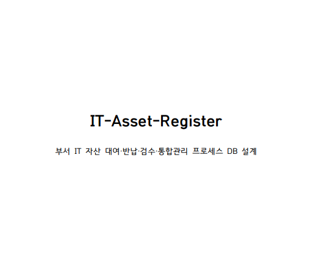

# IT자산장부
## 사내 IT 자산 대여·반납·검수·통합관리 프로세스 DB 설계

 
<b>대표 아이콘</b>

  

 
<b>프로젝트 포스터</b>

  

---

## 👀목차
1. [👥팀원 소개](#팀원-소개)
2. [📚프로젝트 개요](#프로젝트-개요)
3. [🎯서비스 목표](#서비스-목표)
4. [📅WBS](#wbs)
5. [📄프로젝트 기획서](#프로젝트-기획서)
6. [🎬프로젝트 시나리오](#프로젝트-시나리오)
7. [📘요구사항 명세서](#요구사항-명세서)
8. [🧩유스케이스 다이어그램](#유스케이스-다이어그램)
9. [🧱데이터 설계](#데이터-설계)
10. [📊ERD](#erd)
11. [🗃️테이블 명세서](#테이블-명세서)
12. [💾SQL 산출물(DDL/프로시저·트리거)](#sql-산출물ddl프로시저트리거)
13. [🧪테스트 진행 과정](#테스트-진행-과정)
14. [🧭향후 확장 방향](#향후-확장-방향)
15. [📝회고록](#회고록)

---

## 👥팀원 소개

<table>
  <tr>
    <td align="center" valign="top">
       
      <b>팀장:신민수</b> 
      
    </td>

 <td align="center" valign="top">
       
      <b>김승욱</b> 
      
    </td>

  <td align="center" valign="top">
       
      <b>김지연</b> 
      
    </td>

  <td align="center" valign="top">
       
      <b>모희주</b> 
      
    </td>

   <td align="center" valign="top">
       
      <b>박지인</b> 
      
    </td>

  <td align="center" valign="top">
       
      <b>윤준상</b> 
      
    </td>
  </tr>
</table>

---

## 📚프로젝트 개요

사내 IT 자산(노트북, 모니터, 태블릿, 모바일 단말 등)은 프로젝트 투입/부서 이동/외주·협력사 투입 등으로 배정과 회수가 반복됩니다.  
하지만 대여·반납 기록이 메신저/엑셀/담당자 개인 기록으로 분산되어 다음을 한 번에 추적하기 어렵습니다.

- 누가 어떤 자산을 언제부터 사용(할당/출고) 중인지
- 반납 검수 결과(수리 필요/불필요)와 증빙(사진/파일/메모)
- 반납예정일(due_date) 경과 시 미반납 대상 및 반납관리(요구/경고/제재) 발생 이력

본 프로젝트는 **자산 등록 → 할당/출고 → 반납요청 → 회수 → 검수(수리 여부 판정) → 가용 복귀/수리 처리** 흐름을 DB 모델로 고정하고,  
**due_date 경과를 트리거로 반납관리 이벤트를 생성**해 요구/경고/제재를 시스템 로그로 남겨 누락과 지연을 줄입니다(외부 메신저/메일 실연동 제외).

> **목표(구조적 오류 예방)**
- 상태 역전 방지: 검수 없이 AVAILABLE 복귀 금지, 수리 이력 없이 UNDER_REPAIR 전환 금지
- 근거 누락 방지: 요구/경고 로그 없이 제재 상승 금지(정책 예외는 예외 플래그/근거 로그로 고정)

### 🧾참고자료(링크)

<b>참고자료 펼치기 / 접기</b>

- 플래텀(2025): IT 자산관리 솔루션 ‘셀리즈’, ITAM 기능 확장(QR 기반 대여/반납 등)  
  https://platum.kr/archives/252140  
  

- Sellease(셀리즈) 공식: QR코드 기반 임직원 자산 대여 프로세스(스캔 1회 대여/반납, 실시간 현황 등)  
  https://landing.sellease.io/ko/post/revolutionizing-asset-management-with-sellease-qr-code-based-employee-asset-rental  
  

- IT 자산 관리 절차의 정의 및 구현(Definition and implementation of procedures for IT assets managing)  
  https://doi.org/10.17261/Pressacademia.2017.478  
  

---

## 🎯서비스 목표

- 자산 라이프사이클: 등록 → 할당/출고 → 반납요청 → 회수/검수 → (수리) → 가용 복귀 흐름을 상태코드 전이로 강제
- 미반납 관리 이력화: due_date 경과를 트리거로 요구/경고/제재 이벤트 로그를 생성하고, 사용자 누적 스냅샷(overdue_count/warning_count/restriction_level)을 함께 관리
- 운영 리스크 감소: 분실/중복 지급/재고 불일치 및 검수 기준 불일치(담당자 주관 판단)를 이력·상태 전이 규칙으로 최소화
- 근거 기반 이력 추적 구조: 검수 증빙(사진/파일/메모), 정책값, 이벤트 발생 시점값을 로그에 고정 저장해 요구/경고 없이 제재 상승 등 근거 단절을 방지

---

## 📅WBS

  <kbd>🛠 Tool</kbd> <kbd>MS Excel</kbd> <kbd>📌 Output</kbd> <kbd>WBS</kbd>

---

## 📄프로젝트 기획서

- **프로젝트 기획서**: [기획서.pdf](./기획서.pdf)
- 

  <kbd>🛠 Tool</kbd> <kbd>PDF</kbd> <kbd>📌 Output</kbd> <kbd>Planning Doc</kbd>

---

## 🎬프로젝트 시나리오

  <kbd>🛠 Tool</kbd> <kbd>Draw.io</kbd> <kbd>📌 Output</kbd> <kbd>Scenario</kbd>

---

## 📘요구사항 명세서

  <kbd>🛠 Tool</kbd> <kbd>MS Excel</kbd> <kbd>📌 Output</kbd> <kbd>Requirements</kbd>

🔗 [요구사항 명세서](https://docs.google.com/spreadsheets/d/1Ud5T2h4dr9DT8dqLcxDZLFeatAoFF_CawhjO1A6-qOo/edit?gid=0#gid=0)

---

## 🧩유스케이스 다이어그램

  <kbd>🛠 Tool</kbd> <kbd>Draw.io</kbd> <kbd>📌 Output</kbd> <kbd>Use Case</kbd>

---

## 🧱데이터 설계

> TODO: 데이터 설계 개요(엔티티/관계/핵심 규칙) 요약 추가

- 핵심 엔티티 분류(예시)
  - 자산(Asset) / 자산분류(AssetCategory)
  - 사용자(임직원/외주) / 부서 / 권한
  - 대여(출고) / 반납요청 / 반납검수 / 수리
  - 미반납(요구/경고/제재) 이력
- 무결성/감점 포인트 방지용 설계 규칙(예시)
  - 상태 역전 방지(검수 전 가용복귀 금지)
  - 제재 근거 누락 방지(요구/경고 없이 제재 금지)

---

## 📊ERD

  <kbd>🛠 Tool</kbd> <kbd>ERDCloud</kbd> <kbd>📌 Output</kbd> <kbd>ERD</kbd>

---

## 🗃️테이블 명세서

  

  

    <kbd>🛠 Tool</kbd> <kbd>EXEL, spreadsheet</kbd> <kbd>📌 Output</kbd> <kbd>테이블명세서</kbd>
  

---

## 💾SQL 산출물(DDL/프로시저·트리거)

> TODO: SQL 산출물 파일 링크/설명 추가

- DDL
  - `./sql/schema.sql`
- 프로시저/트리거
  - `./sql/procedures.sql`
  - `./sql/triggers.sql`

---

## 🧪테스트 진행 과정

> TODO: 테스트 시나리오/케이스/결과 추가

- 테스트 항목(예시)
  - 대여 → 반납요청 → 반납/검수 정상 플로우
  - 반납예정일 경과 → 요구/경고/제재 누적 조건
  - 상태 역전/중복 처리 차단(제약/트리거 동작 확인)
- 산출물(예시)
  - `./테스트/테스트케이스.md`
  - `./테스트/결과캡처/`

---

## 🧭향후 확장 방향

> TODO: 확장 방향 정리

- QR/바코드 기반 입출고(스캔 로그 테이블 추가)
- 자산 실사(재고조사) 주기 관리 및 불일치 처리 프로세스
- 검수 증빙/수리 이력 고도화(견적/영수증 등 증빙 파일 메타데이터, 업체 테이블 연계)
- 알림 채널 확장(메일/메신저 연동 이벤트 로그)

---

## 📝회고록

> TODO: 회고 작성
